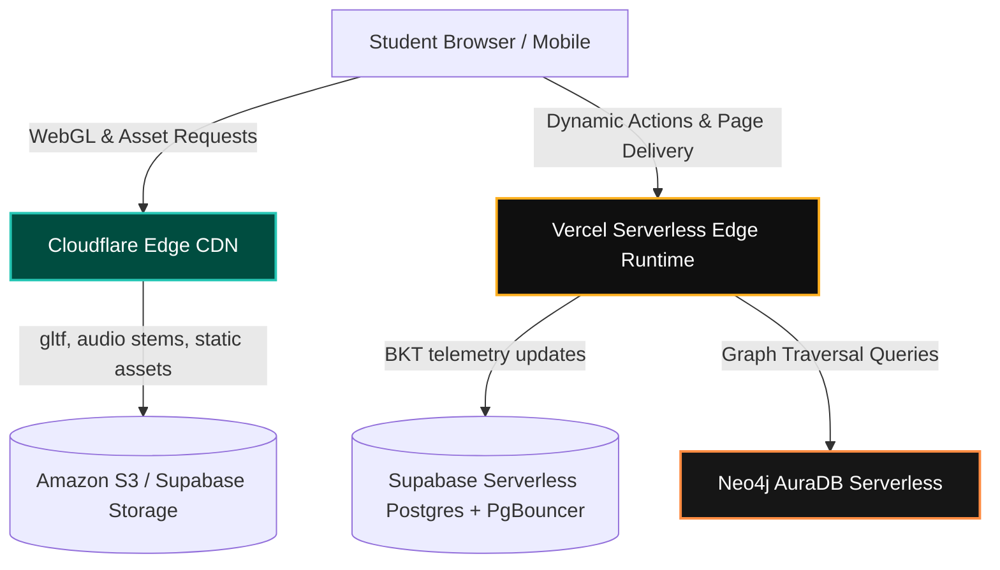

# Local Developer Testing & Production Scaling Guide

## Project Name: Project Vidyā (Knowledge/Clarity)
**Author:** Tony, Lead Systems Engineering Agent  
**Date:** June 1, 2026  
**Status:** **APPROVED / READY FOR PIPELINE**

---

## 1. Local Wi-Fi Mobile Testing (Next.js 0.0.0.0 Binding)

Testing high-fidelity, touch-based 3D animations and audio-tactile responses requires evaluating performance directly on physical smartphones (iOS/Android). 

### 1.1 Binding the Next.js Dev Server to Local Wi-Fi
By default, the Next.js development server binds strictly to `localhost` (`127.0.0.1`), rendering it unreachable by other devices on the same local network. To expose the server to your physical devices over the local Wi-Fi, you must bind it to all interfaces (`0.0.0.0`):

Add the following helper script to your Next.js project's [`package.json`](file:///C:/Users/viraj/Code/Project_Vidya/package.json):

```json
{
  "scripts": {
    "dev": "next dev",
    "dev:local": "next dev -H 0.0.0.0 -p 3000",
    "build": "next build",
    "start": "next start"
  }
}
```

### 1.2 Automated Local IP & QR Scanner Utility
To eliminate the manual steps of looking up your IPv4 address and typing it into a mobile phone, we have implemented an automated script under [`scripts/wifi_dev_qrcode.py`](file:///C:/Users/viraj/Code/Project_Vidya/scripts/wifi_dev_qrcode.py). 

This script:
1.  Automatically detects your active Wi-Fi IPv4 interface.
2.  Generates an **ASCII QR Code** directly in the console using safe characters (`##` and spaces) to prevent character encoding crashes on Windows terminal consoles (CP1252/UTF-8).
3.  Instructs you on how to start the Next.js local server.

#### How to use:
Run the script from your terminal:
```powershell
python scripts/wifi_dev_qrcode.py
```

*Output Preview:*
```text
==================================================
Project Vidya - Wi-Fi Connection Utility
Target URL: http://192.168.1.118:3000
==================================================
Scan the QR code below using your mobile device:

    ##############            ##  ####  ##############    
    ##          ##  ####  ####  ##  ##  ##          ##    
    ##  ######  ##    ##  ##      ##    ##  ######  ##    
    ...
    ##############  ##  ####    ##############    ####    

Scan the QR code above with your mobile device to open the playground.
Booting Next.js on 0.0.0.0:3000...
Run the following command in your Next.js directory:
  npx next dev -H 0.0.0.0 -p 3000
==================================================
```

---

## 2. Remote Testing & Cellular/LTE Tunnels (ngrok Protocol)

Testing social media dynamic sharing cards, Open Graph (OG) tag previews, and cellular/LTE networks requires exposing the local dev machine securely to the public internet.

```mermaid
graph LR
    Phone[Mobile Phone / Cellular] -->|HTTPS Requests| Ngrok[ngrok Secure Tunnel]
    Ngrok -->|Forwards to Port 3000| LocalDev[Local Next.js Server (0.0.0.0:3000)]
    LocalDev -->|Returns WebGL & Canvas| Phone
```

### 2.1 Starting the Public Tunnel
1.  Install `ngrok` globally via npm:
    ```powershell
    npm install -g ngrok
    ```
2.  With your Next.js local server running on port `3000`, expose it via HTTPS:
    ```powershell
    ngrok http 3000
    ```
3.  `ngrok` will output a secure public URL (e.g. `https://a1b2-c3d4.ngrok-free.app`). 

### 2.2 Crucial Secure Context Requirements (HTTPS)
Many advanced browser APIs that Project Vidyā relies upon have a strict **Secure Context requirement**:
*   **MediaRecorder API:** Blocked on standard unencrypted HTTP networks (e.g., `http://192.168.1.118:3000`). It will only execute over `localhost` or verified `HTTPS` tunnels.
*   **Web Audio API / Data Sonification:** Requires secure browser permissions for reliable background audio stems on mobile platforms.
*   **Testing Sharing Previews:** Platforms like Facebook, Twitter, and LinkedIn parse OG meta-tags server-side. They cannot see your local IP. Testing your dynamic metadata previews requires providing social media crawlers with your secure `ngrok` domain.

---

## 3. Production Scaling Strategy

To transition Project Vidyā from local prototypes to a production-ready enterprise app capable of serving millions of concurrent students without resource exhaustion or astronomical cloud bills, we establish a robust **Serverless-First Production Architecture**:



### 3.1 Next.js Serverless Edge Runtime on Vercel
*   **Decoupled SSR/ISR:** The static components of curriculum nodes and the visual skill trees are served via **Incremental Static Regeneration (ISR)**. They are compiled once and cached globally, achieving near-zero load times.
*   **Edge Middleware Routing:** Student difficulty routing (`Grade 9` vs. `Postgrad/GATE`) and dynamic domain redirection are handled via lightweight Next.js Edge Middleware functions, which execute at the serverless edge closest to the user (< 50ms execution overhead).

### 3.2 Global CDN Caching for Heavy Visual/Audio Assets
Physical AI simulations contain heavy assets that can easily swamp backend compute and transfer budgets.
*   **WebGL Assets (GLTF/GLB models):** Static 3D meshes (orbital spheres, pendulums, vector grid geometries) and dynamic audio STEM files are hosted on **Amazon S3 / Supabase Storage** and cached aggressively behind **Cloudflare Edge CDN**.
*   **Caching Rules:** We enforce long-lived cache headers (`Cache-Control: public, max-age=31536000, immutable`) alongside Gzip/Brotli compression to minimize mobile network load times.

### 3.3 Serverless Neo4j AuraDB Integration
Traversing the massive multi-level curriculum DAG (resolving student prerequisites, locking and unlocking nodes) requires highly complex graph traversal queries.
*   **The Scaling Solution:** Migrate local Neo4j instances to **Neo4j AuraDB (Serverless / Managed Cloud)**. 
*   **Caching Graph Traverses:** Because the curriculum standards DAG structure itself changes very infrequently, we cache the compiled graph topology locally inside the Next.js runtime memory or a serverless Redis edge cache, using Neo4j strictly as a write-master and metadata catalog.

### 3.4 Supabase Serverless Postgres & PgBouncer Scaling
*   **The Bottleneck:** When millions of anonymous users simultaneously execute their first node, the DB executes massive transactional merges into permanent profiles on sign-up. This can easily exhaust PostgreSQL's connection pool.
*   **The Scaled Solution:** 
    *   Implement **PgBouncer** (Supabase's built-in connection pooler) to handle thousands of concurrent write transactions.
    *   Index key relational tables: Ensure `student_problem_attempts` is heavily indexed on `(user_id, problem_id)` and `user_bkt_states` is indexed on `(user_id, kc_id)`.
    *   Leverage Supabase **Read Replicas** for intensive cognitive engine calculations, keeping the write-master clear for instantaneous signup transitions.
